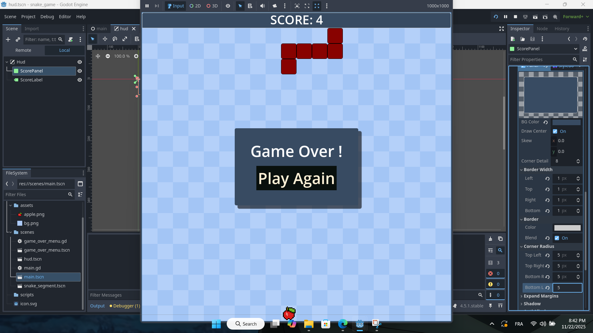

# Snake Game

A classic Snake game built with Godot Engine. This is my first game development project, created while learning game development fundamentals.



---

## About

This is a modern take on the timeless Snake game where you control a growing snake, eat apples, and try not to crash into yourself or the walls. Built from scratch (coding with russ yotube channel), this project helped me understand core concepts like grid-based movement, collision detection, and game state management.

---
## Platform

This game is hosted and available to play on **[itch.io](https://itch.io)** - a platform for indie game developers to share their creations.

---
## Features

- **Classic Gameplay** – Traditional snake mechanics with smooth grid-based movement  
- **Score Tracking** – Keep track of your progress as you eat more apples  
- **Game Over System** – Retry mechanism when you lose  
- **Clean UI** – Simple and intuitive interface  
- **Responsive Controls** – Arrow key controls for precise movement  

---

## Built With

- **Godot Engine** v4.5.1.stable.official  
- **GDScript** – Godot's built-in scripting language  
- **2D Graphics** – Custom sprites and backgrounds
- **Hosted on** - itch.io

---

## Play the Game

[Click here to play the game directly in your browser](https://yacinetalahari.itch.io/yacinetalahariitchiosnake-game)

**Note: This game requires a keyboard and is best played on PC/laptop.**

---


## Project Structure

```
snake-game/
├── assets/
│   ├── apple.png
│   ├── bg.png
│   └── screenshot.png
├── scenes/
│   ├── game_over_menu.gd
│   ├── game_over_menu.tscn
│   ├── hud.tscn
│   ├── main.gd
│   ├── main.tscn
│   └── snake_segment.tscn
├── scripts/
└── project.godot
```

---

## Working on this project taught me:

- Grid-based game mechanics and coordinate systems  
- Input handling and responsive controls  
- Game state management (playing, game over, restart)  
- Scene management in Godot  
- Array manipulation for snake body segments  
- Random positioning algorithms (food spawning)  
- Collision detection systems  

---

## Contributing

This is a learning project, but suggestions and feedback are always welcome!  
Feel free to open an issue or submit a pull request.

---

## License

This project is licensed under the **MIT License** – see the LICENSE file for details.

---

## Acknowledgments

- Thanks to the Godot community for excellent documentation and tutorials  
- Inspired by the classic Snake game that started it all  
- Special thanks to Coding With Russ for the tutorial guidance  

---

## Contact

Have questions or want to connect? Feel free to reach out!

Made with love and lots of learning  
**author :**  
Copyright (c) 2025 **Yassine Talahari**
